# 🎬 megaLibro - Sprint 7 - Visual Basic 6 
**by Miguel Angel Gómez Romero**

Este es un proyecto desktop desarrollado en **Microsoft Visual Basic6**, es un CRUD sencillo que consume una base de datos

---

## 📊 Sprint Review

Aquí está la presentación del Sprint 7, donde se muestran las tareas completadas y los próximos pasos. Puedes ver el documento completo a continuación:

[🔗 Ver presentación Sprint 7 (Google Slides)](https://docs.google.com/document/d/1QO8UCPAw0dQSnmPRudnz8fLPw0eXkzSCcD51BrwAGtw/edit?usp=sharing)

### ✅ Resumen breve del Sprint 7
- Interfaz Grafica
- Funcionalidad de Botones
- Guardado en base de datos
- Perfil de usuario con preferencias

---

## 🗃️ Base de Datos - SQL Server
 la API.
El directorio `MegaLibro/Base De Datos` contiene los archivos necesarios para crear las tablas y poblar la base de datos utilizada por la app.

### 📁 Archivos incluidos

- `SQLQuery2.sql`: define la estructura de la base de datos (tablas, relaciones, etc.).
- `SQLQuery3.sql`: carga de datos iniciales.

Puedes ejecutar estos archivos en:

- **SQL Server Management Studio**

## 📸 Vista previa - Mockups

- **Form1**  
  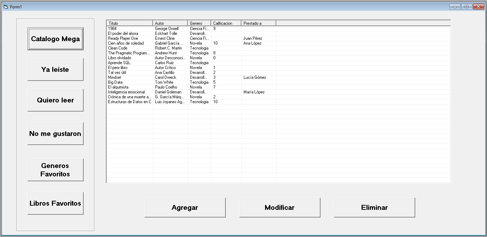

- **FrmLibro**  
  

- **Funcionamiento**

  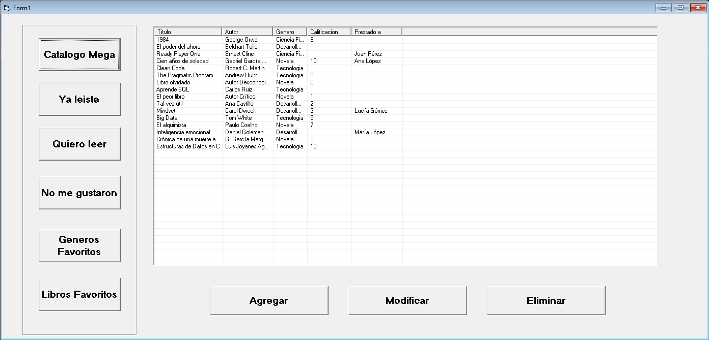

  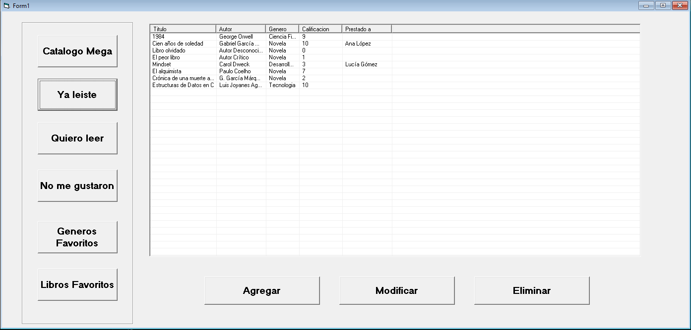

  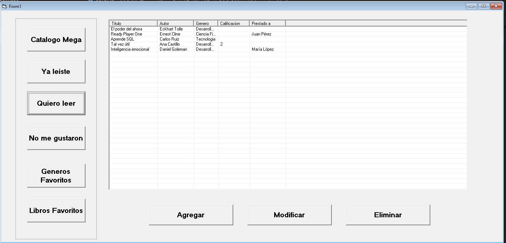

  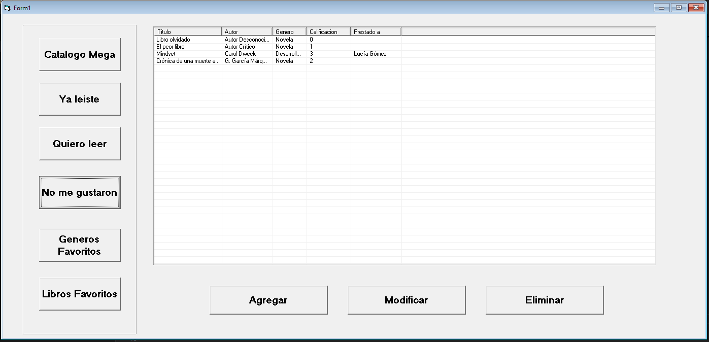

  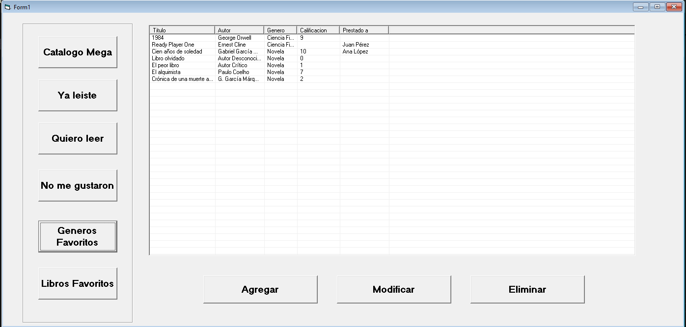

  

- **Botones Agregar,Modificar,Eliminar**

  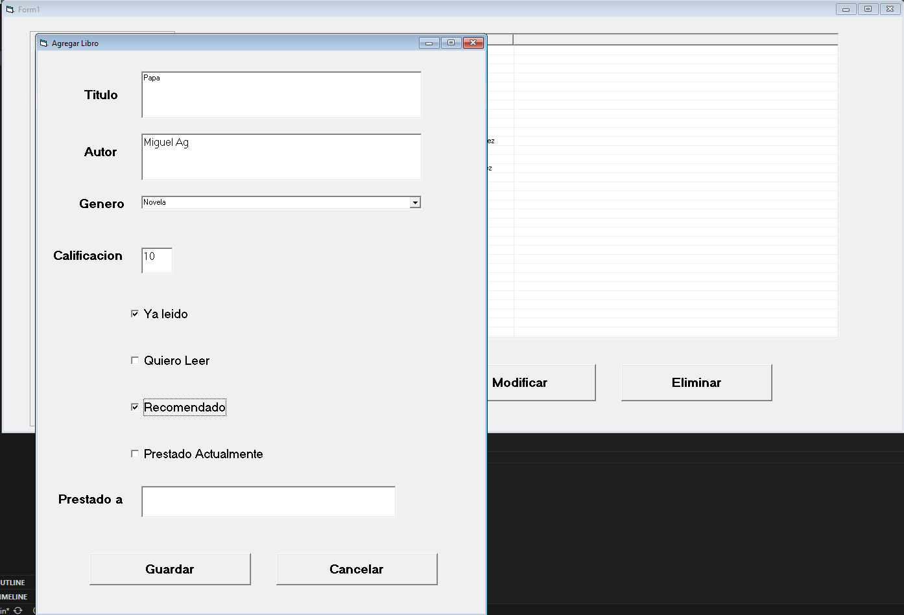

  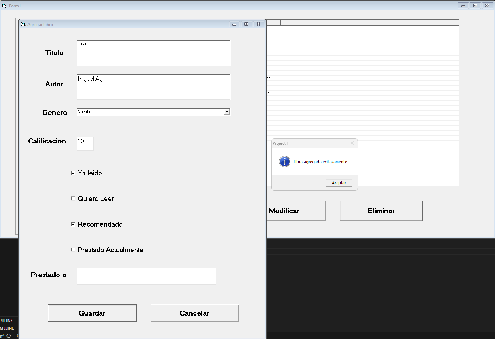
  
  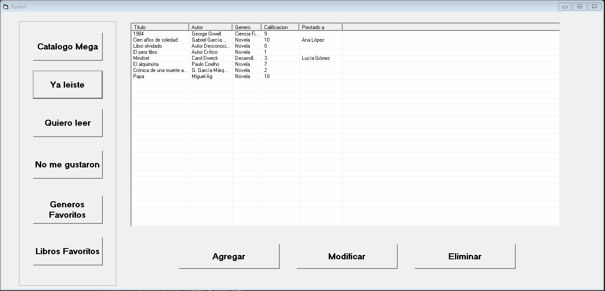

  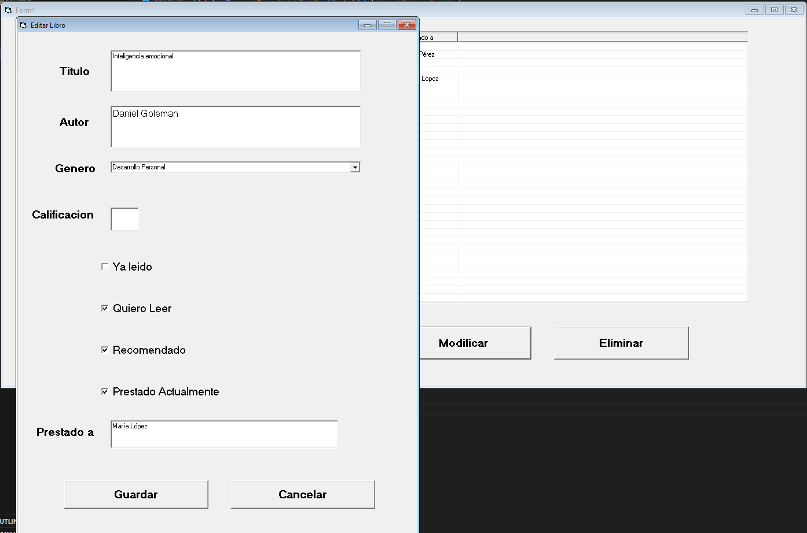

  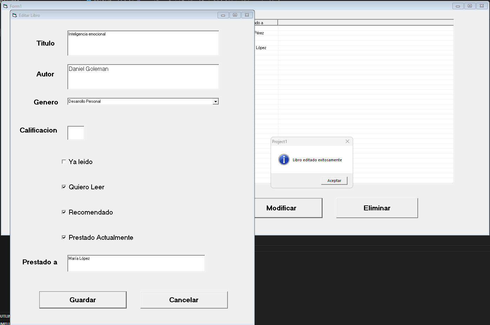

  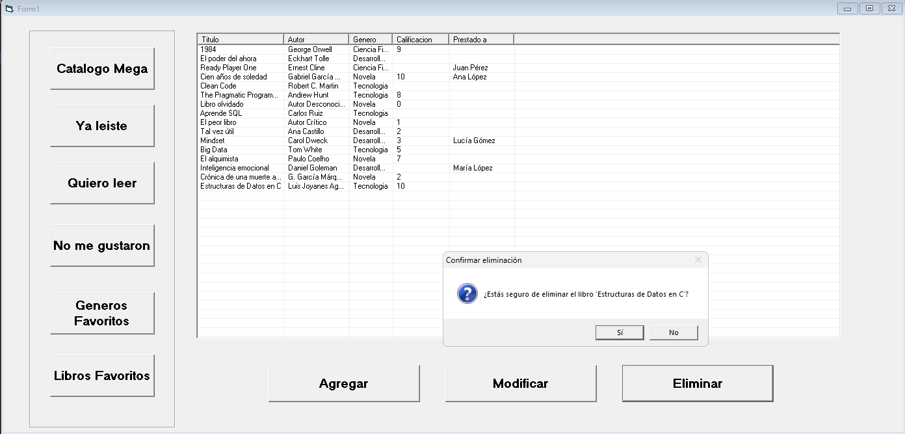

  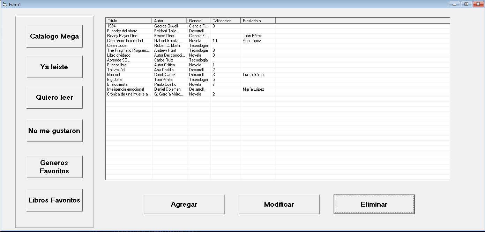

  ![]

---

## ⚙️ Tecnologías usadas
- MVB6 
- SQL Server

---
