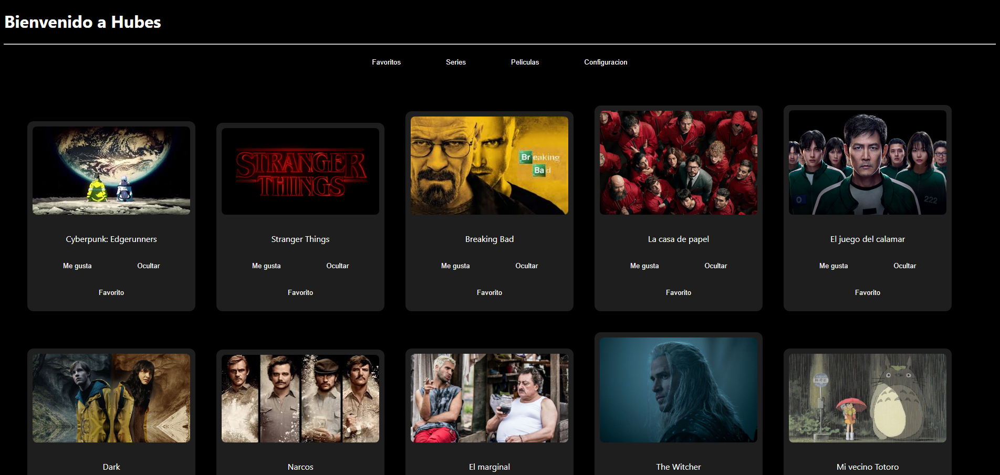

# megaProyecto = Sprint 1 

Este es un proyecto web que simula una plataforma de streaming con navegación entre secciones como **Películas**,
**Series**, **Favoritos** y **Configuración**.

## 🚀 Características

- Navegación entre diferentes páginas HTML
- Visualización de series y películas con imágenes
- Separación del contenido por tipo en archivos JSON
- Estilo limpio y responsivo


## 📸 Vista previa




## Que hice mal? ❌

- No implementar un login mas ❎
- Manejar los cambios en la rama Main ❎
- No implementar la vista de las peliculas ❎

## Que hice bien? ✔️

- Implementar una vista agradable de las peliculas ✅
- Implementar botones reactivos ✅
- Buenas practicas ✅


## ⚙️ Tecnologías usadas
- HTML

- CSS

- JavaScript

- JSON

## 📁 Contenido JSON

El contenido multimedia se divide en tres archivos:
- `contenido.json`: Contiene un listado de series.
- `series.json`: Contiene un listado de series.
- `peliculas.json`: Contiene un listado de películas.

## Formato de los elementos:
```json
{
  "titulo": "Nombre del contenido",
  "imagen": "./img/images.jpeg"
}

